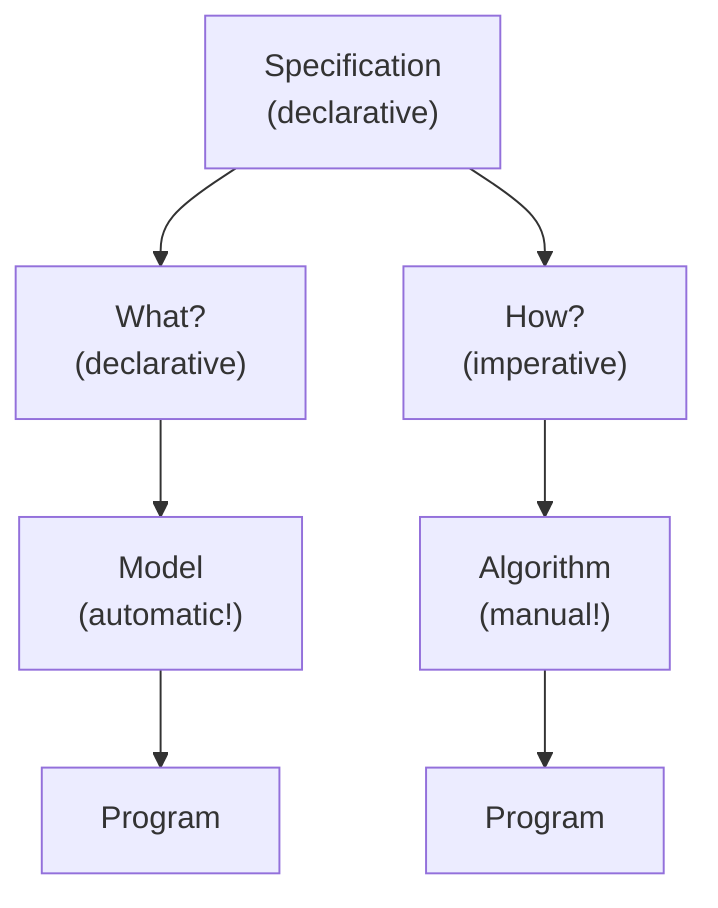

# CPMpy

## Setup

```bash
pyenv local 3.11.9
python -m venv .venv
source .venv/bin/activate
pip install --upgrade pip
pip install -r requirements-dev.txt
pip install -r requirements.txt
```

### Generate PDFs

```bash
mkdir -p pdfs && \
  echo "*" > pdfs/.gitignore && \
  jupyter nbconvert --to pdf --output-dir=pdfs session[1-6]*.ipynb
```

## [1. Declarative Modelling](./session1-modelling.ipynb)



Components:

- **Parameter**: given; has a value from a problem description.
- **(Decision) variable**: not given; implicitly existentially quantified; find satisfying (optimal) values in their domains; vectorised operations are more efficient.
- **Domain**: set of values that a variable can take.
  - Sparse domain: add constraints to forbid specific values, e.g. `x != 3`, `x != 5`, etc.
- **Variable expression**: takes a value that depends on the value of one or more decision variables
- **Constraint**: a Boolean-valued variable expression that must be true; a restriction on the values that its variables can take conjointly.
- **Objective (function)**: a numeric variable expression whose value is to be minimised or maximised
  - Feasibility vs. Optimality.
  - No objective = satisfaction problem.

**Consistency**: Property of a constraint being satisfied by the current variable assignments; ensures that the model is in a valid state.

## 2. Solving Techniques

### [2.1. Debugging](./session2_a-debugging.ipynb)

Most to least likely cause of bugs:

1. The model:
   - test early and often: activate constraints one by one, check the domains
2. The modelling library:
   - e.g. parentheses for logical expressions
3. The solver:
   - try with a different solver

### [2.2. Solving](./session2_b-solving.ipynb)

Huge search space - need intelligent search!

- **Search**: explore the space of candidate solutions, e.g. backtracking, and reduce the domains of the decision variables.
  - (Note the difference between a domain as a technology-independent declarative entity when modelling; a domain as a CP-technology procedural data structure when solving.)
- **Inference**: reduce the space of candidate solutions.
- **Relaxation**: exploit solutions to easier problems.

**Methodologies**:

- DP
- Greedy
- Local search (LS)
- Evolutionary algorithms (EAs)

**Search strategies**:

- Variable Selection: has an impact on the size of the search tree.
  - First-Fail Principle: first try where you are most likely to fail, i.e. a decision variable with smallest current domain, involved in the largest number of constraints, ...
- Domain Partitioning:
  - Best-First Principle: first try a domain part that is most likely to have values that lead to solution (compare: greedy approach).

### [2.3. Explaining](./session2_c-explaining.ipynb)

#### Deductive explanations

Why is it unsatisfiable? Pinpoint to a subset of constraints causing a conflict - that cannot be satisfied in conjunction.

- Minimal Unsatisfiable Subsets (MUSes):
  - Naive algorithm: deletions.
- Optimal Unsatisfiable Subsets (OUSes): Assign each constraint a weight.
- Smallest Unsatisfiable Subsets (sMUSes): Minimise cardinality = OUS with all equal weights.

#### Counterfactual explanations

How can I make it satisfiable?

- Maximal Satisfiable Subsets (MSSes): there is no constraint c outside the MSS s.t. adding c would remain satisfiable.
- Minimal Correction Subsets (MCSes):
  - smallest subset of constraints whose removal results in a MSS
  - complements of MSSes
  - grow a set of constraints until UNSAT, and take the complement

#### Computation

A MUS is a hitting set of all MCSes, and an MCS is a hitting set of all MUSes.

- A hitting set contains at least one element from each set in a collection.

Find all MUSes and pick the optimal MUS?

- No! Potentially exponential number of MUSes.
- OCUS algorithm: Find a minimal hitting set of all found MCSes!

How to compute the optimal MCS?

- Optimisation problem:

  - MaxCSP: Max number of satisfied constraints, i.e. largest MSS, whose complement is the smallest MCS.

    ```python
    maxcsp_model.maximize(cp.sum(constraints))
    maxcsp_model.solve()
    mcs = [c for c in constraints if c.value() is False]
    ```

### [2.4. Reification](./session2_d-reification.ipynb)

A reified variable (**double implication** - iff!, e.g. `b == (x<y)`) allows reasoning about the truth of a constraint and reuse of logical components!

## [3. Global Constraints](./session3-global_constraints.ipynb)

- defined over a non-fixed number of variables (non-fixed arity)
- captures a specific combinatorial substructure
- more efficient: better conflict detection and filtering of the search space (in CP solvers)

All global constraints can be reified - be nested in other expressions: e.g. `cp.sum(cp.AllDifferent(x), cp.AllDifferent(y), cp.AllDifferent(z)) > 2`.

Examples:

- `AllDifferent`:
  - conjunction of `n(n-1)/2` disequality constraints
  - flow model that can detect inconsistent arcs early
  - pigeonhole principle!
- `Circuit(S)`:

  - iff the arcs form a Hamiltonian circuit: each vertex is visited exactly once
  - TSP: where `S_v = S[city]` is the set of vertices `v` to which there is an arc from `v` / the city

    ```python
    model += cp. Circuit (S)
    model.minimize(sum(distance[city, S[city]] for city in range(cities)))
    ```

- `Table(X, T)`:
  - restricts the values of the variables in a 1D array `X` to combinations listed (as rows) in the 2D array `T`
- `GlobalCardinalityCount(X, V, C)`:
  - at best more efficient
  - at worst will be decomposed

## [4. Modelling Techniques](./session4-viewpoints-channelling-auxiliary_variables-implied_constraints.ipynb)

### 4.1. Viewpoints

Both the size of the search space (space complexity!) and the way constraints can be formulated change based on the viewpoint.

### 4.2. Channelling

Including the variables and constraints of both viewpoints may allow the solver to infer different things from each one, and reduce the search space.

A channelling constraint fixes the value of 1 set of decision variables when the values of the decision variables they are redundant with from the second set are fixed (can be 1 or 2-way) and makes sure that assignments (and domain pruning) on one viewpoint are propagated to the other.

### 4.3. Auxiliary Variables

### 4.4. Implied (or Redundant) Constraints

Entailed by the constraints defining the problem:

- therefore do not change the solutions / logically redundant
- may cut infeasible parts of the search tree
- benefit: solving may be faster without losing any solutions
- typically when no global constraint exists to capture a substructure of the problem
- but adding a lot of constraints that don't reduce search will actually increase run time

## [5.1. Decompositions](./session5_a-decompositions-problem_aware-solver_aware.ipynb)

[Transformations](https://cpmpy.readthedocs.io/en/latest/#supported-solvers):

1. SMT: decompose globals, e.g. Z3,- if many disjunctive constraints.
2. CP: flatten, e.g. OR-Tools, Choco,- if many global constraints.
3. ILP: linearise, e.g. Gurobi,- if many linear constraints.
4. PB: int to bool, e.g. Exact,- HW/SW verification, resource allocation, scheduling.
5. (max)SAT: pb to sat, e.g. PySAT
   - Inputs: CNF - conjunction of clauses (disjunctions).
   - HW/SW verification, resource allocation, model checking.
   - NP-complete: any combinatorial problem can be encoded into SAT.

No solving technology or backend can be universally better than all the others, unless `P= NP`.

### 5.1.1. Problem-Aware Decompositions

### 5.1.2. Solver-Aware Decompositions

### 5.1.3. Low-Level Modelling

## [5.2. Algorithm and Hyperparameter Selection and Configuration](./session5_b-algorithm_selection-algorithm_configuration-hyperparameter_configuration.ipynb)

### 5.2.1. Algorithm Selection

**Best algorithm for the problem**: ML can be used to build a performance model to predict which algorithm to use for a given instance given the instance's features (no., types of constraints, etc.).

### 5.2.2. Algorithm Configuration

**Best search strategy**: based on features of the problem/instance.

### 5.2.3. Hyperparameter Configuration

**Best parameter configuration**: parameter setting that maximises the performance of the algorithm on the input data - large performance improvements possible, without changing the model!

## [6. Symmetry and Dominance Breaking](./session6-symmetry-dominance_breaking.ipynb)

### Symmetry

A symmetry is a permutation of values or decision variables (or both) that preserves all constraints and solutions.

By type:

- **Value symmetry**: a permutation of the values.
- **Variable symmetry**: a permutation of the decision variables.
- **Index symmetry**: a permutation of slices of an array of decision variables.

By origin:

- **Problem symmetry**: inherent to the problem itself, detectable in every model of the problem, e.g. value symmetry in graph colouring.
- **Instance symmetry**: detectable in a specific instance of a CSP, depending on the particular valules or structure of the instance, e.g. variable symmetry due to the structure of a specific instance of a graph colouring problem.
- **Model symmetry**: arises from a specific representation of a model, not detectable in every model; can be avoided by using a different model.

### Symmetry class

An equivalence class of solutions under all the considered symmetries, incl. their compositions.

### Symmetry breaking

Keep as few as few members per symmetry class as possible (ideally one).

- by **reformulation**: elimination of model symmetries by reformulating the model.
- with symmetry-breaking **constraints**:
  - static:
    - variable symmetries: lexicographic ordering on the variables.
    - index symmetries: lexigraphic ordering on the tensor slices (rows/cols).
  - dynamic: during search, e.g. the `Increasing(X)`, `Decreasing(X)` global constraints.

### Dominance

In optimisation problems, the minimisation of an objective function `f` determines optimality; exploring sub-optimal assignments should be avoided.

### Dominance breaking

A (partial) assignment that satisfies the constraints can be forbidden if it is dominated.
